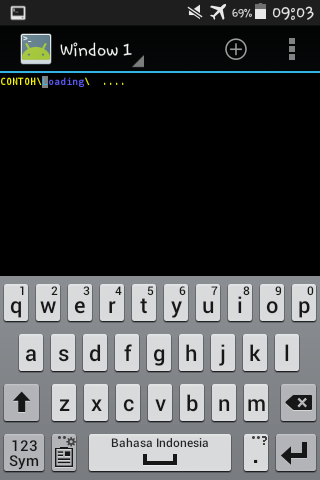

# NAME

progsche - cool progressbar

# SYNOPSIS
    progsche help
    
    # list available option
    progsche.sh --help

    # run this script  independently
    progsche.sh

    # customize the text yourself while the animation is running and set when the animation should stop
    progsche.sh --custom  $ 100

    # customize your own goodbye text when it's time for animation to stop, it loads a string data type with a maximum limit of 9 strings
    progsche.sh --custom $ 100 The Quick Brown Fox Jumped Over The Lazy Dogs. 

    # display version number
    progsche.sh --version

    # display about this script 
    progsche.sh --about

# DESCRIPTION
Progsche is a progress bar one of the other options you should try to collect on your computer/smartphone although it's not a program that can monitor tasks from commands like cp, mv, dd, tar and others, kind of progress - coreutils.

just a demo program to show general animation bar but improved for entertainment purpose on your desk. Progsche was created as a whimsical project inspired by the DHCP progress bar.

# FEATURE
There are 3 features.

- Colorfull animations
> Many colors on animation
- Customization is your way
> Create your own how the progress bar should display the output and set the stop time as well. Mandatory :-P
- Say Goodbye Outputs
> Can now modify the final appearance if time has run out. Option

# INSTALLATION & USAGE
Install via termux 

> pkg install mksh

> pkg install git

> cd ~

> git clone https://github.com/luisadha/progsche.git

> cd progsche

> mksh progsche.sh --help'

# USAGE legacy
See Raw content "https://raw.githubusercontent.com/luisadha/progsche/main/progsche.sh" and tap Download icon at your browser, then open your Terminal Emulator by jackpal:
Type "su" without the quotes then Enter. And

Short way
1. NON-PATH Location, path: /sdcard/downloads (!! Match where the script file is located!!)

    Type `cd /sdcard` then Enter.
    
    Type `cd downloads` then enter.
        
    Type `sh progsche.sh` then Enter.

2. PATH Location.

    Type `progsche.sh` then Enter.

# DEPENDENCIES

su (non termux)

mksh

# BUG REPORTING

Plese use github issues: http://github.com/luisadha/progsche/

# AUTHOR

Luis Adha <adharudin14@gmail.com>
